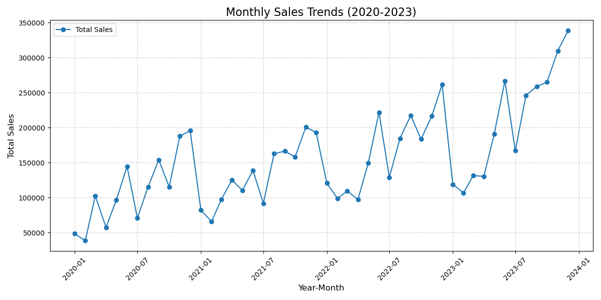
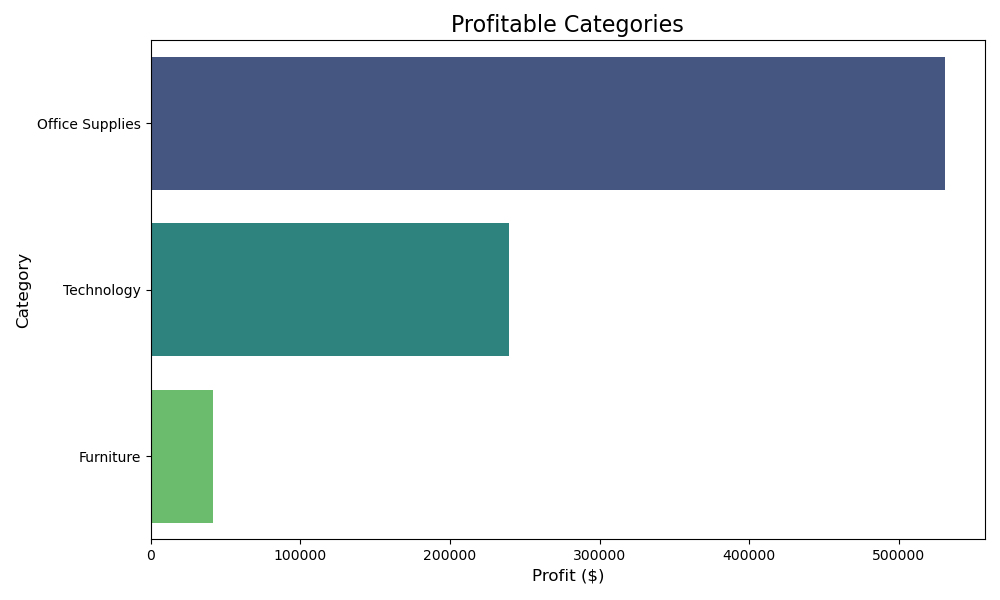
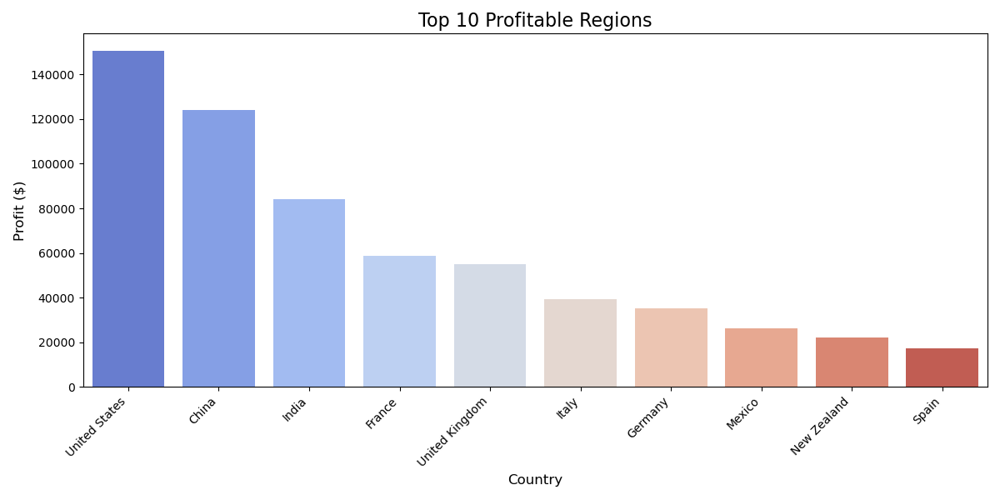
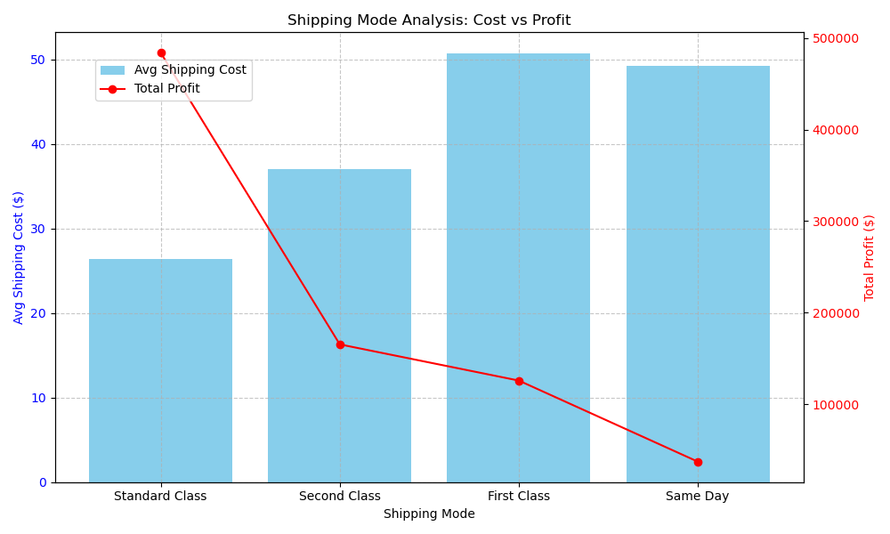

# EcomAnalyticsDashboard

Interactive dashboard for e-commerce sales analysis.

## Prerequisites

Before running the scripts, ensure you have the required Python modules installed.

### Setting up the Environment

1. Create a virtual environment using Conda:
   ```bash
   conda create --name ecommerce_env python=3.9 -y
   conda activate ecommerce_env
   ```
2. Install dependencies from `requirements.txt`:
   ```bash
   pip install -r requirements.txt
   ```

## Sales Trends Analysis

This repository includes a script to analyze monthly sales trends based on e-commerce data.

- **Script**: `sales_trends_analysis.py`
- **Output**: `sales_trends.csv`

### Functionality

- Processes the `merged_dataset.csv` file to calculate total sales for each month.
- Generates a CSV file (`sales_trends.csv`) with two columns:
  - `YearMonth`: Year and month of sales data.
  - `Sales`: Total sales for the corresponding month.

### Usage

1. Ensure the `merged_dataset.csv` file is present in the root directory.

2. Run the script:
   ```bash
   python sales_trends_analysis.py
   ```
3. The output will include:
   - A CSV file (`sales_trends.csv`) with monthly sales data.
   - A PNG image (`sales_trends_plot.png`) of the graph.

### Example Output

```yaml
YearMonth,Sales
2020-01,48625.5
2020-02,38631.0
2020-03,102718.5
---
2023-12,338601.0
```

### Observations

The following graph illustrates the monthly sales trends from January 2020 to December 2023.



1. **Seasonal Peaks:** Sales consistently peak in November and December, aligning with holiday shopping seasons like Black Friday and Christmas.
2. **Growth Trend:** There is a steady increase in overall sales over the years, with 2023 having the highest sales figures.
3. **Off-Season Dips:** Sales are typically lower in January and February, likely due to post-holiday slowdowns.

## Profitability Analysis

The `profitability_analysis.py` script calculates the profitability of categories, regions, and products based on the provided e-commerce dataset.

### Output Files

1. `profitable_categories.csv`: Lists the total profit by product category (e.g., Office Supplies, Technology, Furniture).
2. `profitable_regions.csv`: Lists the total profit by country, highlighting the most and least profitable regions.
3. `profitable_products.csv`: Lists individual product names and their respective profits.

### Usage

To run the analysis:

```bash
python profitability_analysis.py
```

#### Visualizations:

1. **Profitable Categories:**
   - Saved as `profitable_categories_chart.png`.
   - Highlights the most profitable product categories.



- **Office Supplies** has the highest profit ($531,066.31), which may indicate consistent sales, lower costs, or better profit margins in this category.

- **Technology** comes second ($239,528.96), likely due to high-value items (e.g., laptops, smartphones). However, its lower rank compared to Office Supplies could imply narrower margins or higher costs.

- **Furniture** has a significantly lower profit ($41,720.21). This might be due to higher shipping costs, bulkier items, or lower demand.

2. **Profitable Regions:**
   - Saved as `profitable_regions_chart.png`.
   - Highlights the top 10 most profitable regions.



- **United States** ($150,725.36), **China** ($123,995.01), and **India** ($84,221.24) are the top regions.

- **Negative profits** in countries like **Vietnam** ($-842.06) and **Pakistan** (-$1,139.99) highlight regions that are underperforming, where profitability could be improved.

## Shipping Cost Analysis

This analysis focuses on evaluating the average shipping cost and total profit for each shipping mode. The `shipping_costs_analysis.py` script groups data by `Ship.Mode` and calculates:

- `avg_shipping_cost`: The mean shipping cost for each mode.
- `total_profit`: The total profit generated by each shipping mode.



#### Key Trends:

1. **Standard Class (Lowest Cost, Highest Profit):**:
   - Since customers pay the lowest shipping cost, it likely makes this option the most popular. High usage translates to the highest total profit, not because of shipping costs but because of the higher volume of orders using this mode.
2. **Second Class (Moderate Cost and Profit):**:
   - Second Class has a higher shipping cost but generates moderate profits. This might suggest that a segment of customers prioritizes faster delivery but isn’t as price-sensitive as Standard Class users.
3. **First Class (High Cost, Lower Profit):**
   - First Class shipping has significantly higher costs to customers, which likely limits its usage
4. **Same Day (High Cost, Lowest Profit):**
   - Same Day shipping has the highest cost to customers but generates the lowest total profit. This suggests it is rarely chosen.
